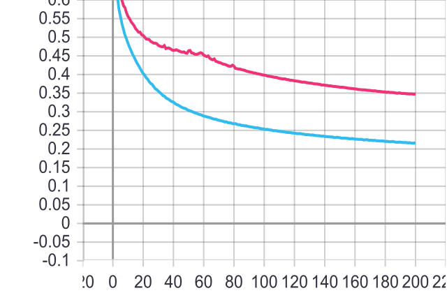

# Cluster-GCN in PyTorch
[](https://arxiv.org/abs/1905.07953)
[](https://drive.google.com/drive/folders/1Tfn-yABlW5JheyYItyRyrMGtmQdYN7wm?usp=sharing)
[](https://github.com/pyyush/ClusterGCN-amazon2M/blob/master/README.md)
[](https://github.com/pyyush/ClusterGCN-amazon2M/blob/master/README.md)\
PyTorch implementation of "Cluster-GCN: An Efficient Algorithm for Training Deep and Large Graph Convolutional Networks"[1].
This implementation makes use of the amazon2M dataset introduced in [1]. Raw data files used to curate this dataset can be downloaded from [2] while the processed data files used in this implementation can be downloaded by clicking on the above Download amazon2M badge.

> Cluster-GCN: An Efficient Algorithm for Training Deep and Large Graph Convolutional Networks
> Wei-Lin Chiang, Xuanqing Liu, Si Si, Yang Li, Samy Bengio, Cho-Jui Hsieh.
> KDD, 2019.
> [[Paper]](https://arxiv.org/abs/1905.07953)

## Requirements:

* install the clustering toolkit metis and other required Python packages.
```
1) Download metis-5.1.0.tar.gz from http://glaros.dtc.umn.edu/gkhome/metis/metis/download and unpack it
2) cd metis-5.1.0
3) make config shared=1 prefix=~/.local/
4) make install
5) export METIS_DLL=~/.local/lib/libmetis.so
6) pip install -r requirements.txt
```
## Usage:
* The Scipts assume that the data files are stored in the following structure.
  ```
  ./datasets/amazon2M/amazon2M-{G.json, feats.npy, class_map.json, id_map.json}
  ```
 * Run the below shell script to perform experiments on amazon2M dataset.
```
./amazon2M.sh
```
* To Visualize Training Process
```
tensorboard --logdir=runs --bind_all
```
## Results:
```
F1-micro => 0.8803 (Cluster-GCN paper - 0.9041)
Running Time => 1540s (Cluster-GCN paper - 2289s)
Time-per-epoch => 6.619s
```
* Training Loss (Pink - default 0.8803 F1) | (Blue - 0.8830 F1)
<figure>
  
</figure>

* An F1-micro score of 0.8830 (Cluster-GCN paper - 0.9041) was achieved using the following hyper-params:
```
--batch_size 10 
--num_clusters_train 15000
--num_clusters_test 1
--layers 4 
--epochs 200 
--lr 0.01 
--hidden 2048 
--dropout 0.2 
--lr_scheduler -1
--test 1
```
## References:
[1] Wei-Lin Chiang et al. "Cluster-GCN: An Efficient Algorithm for Training Deep and Large Graph Convolutional Networks"\
[2] http://manikvarma.org/downloads/XC/XMLRepository.html
